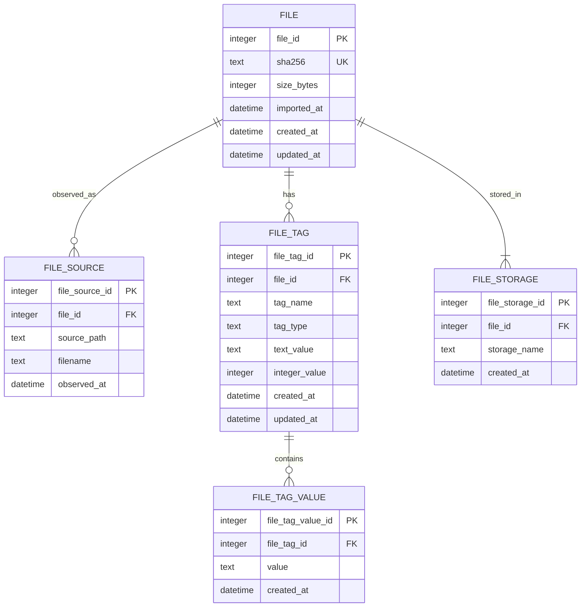

# Collection database

Each collection owns one SQLite database. The database stores the current file
index and assignments for that collection. YAML remains the source of truth for
tag definitions, relationships, collection definitions, and storage provider
configuration. SQLite repeats only the normalized tag name, tag type, and
storage name attached to persisted assignments. These are state snapshots, not
independent definitions: the current YAML catalog decides whether they remain
valid and usable.

## Schema

The SQL migration must use the singular table names shown in this diagram.

## Representation rules

- `FILE.sha256` is the authoritative lowercase SHA-256 content identifier.
  `file_id` is an internal join key.
- `FILE_SOURCE` records where imported bytes were observed. Source files are
  not storage copies and may no longer exist after import.
- One `FILE_TAG` row represents one assigned tag. `(file_id, tag_name)` is
  unique.
- A `bool` tag is represented by the presence of its `FILE_TAG` row. Boolean
  false is absence and is never stored.
- `text`, `value`, `date`, and `datetime` use `text_value`. Dates and datetimes
  retain their validated canonical string forms.
- `int` uses `integer_value` and is restricted to the documented non-negative
  signed 64-bit range.
- A `multivalue` tag has one `FILE_TAG` parent and one `FILE_TAG_VALUE` child
  per assigned predefined value. `(file_tag_id, value)` is unique.
- `FILE_STORAGE` stores normalized logical storage assignments. Physical paths
  are derived from `storage.yaml` and the content hash; repository definitions
  and paths are not copied into the database.
- The built-in `storage` tag is synthesized from `FILE_STORAGE` when building
  evaluator state. It is not duplicated in `FILE_TAG`.

Foreign keys use cascading deletion for child rows. The migration must add
checks that make typed value columns unambiguous, plus indexes for tag/value
search, source lookup, and storage lookup. Every indexed file must have at
least one storage assignment during normal operation; Core enforces this
cross-row invariant inside its mutation workflow.

## Import and duplicate behavior

The MVP imports one regular file at a time. If its SHA-256 already exists in
the selected collection, import fails without changing tags, sources, storage
copies, or the source file. The error identifies the existing SHA-256 and the
known source and storage information needed to find that file.

This strict behavior avoids turning `import` into an implicit mutation command.
A future explicit command or flag may reuse an existing record.

## Mutation and failure ordering

Full lowercase SHA-256 is the only MVP file selector. Unique hash prefixes are
not accepted.

Operations that add storage copies stage and finalize every physical copy
before committing the SQLite transaction. If copying or SQL fails, the
transaction rolls back and the operation removes only copies it created. The
source is removed for `remove_on_upload` only after all copies and the database
commit succeed and after verifying that the source still contains the imported
bytes.

Operations that remove storage assignments commit the logical removal before
deleting the physical copy. A deletion failure may therefore leave an
unreferenced copy, but it must never leave a committed row pointing to a copy
that the operation already deleted. Removing the final storage assignment also
deletes the file and its dependent rows in the same database transaction.

A process crash may leave staged or finalized content that is not referenced by
SQLite. Such content is safe garbage: normal operations ignore it, and automatic
orphan cleanup is outside the MVP. A crash must not cause source deletion before
a successful import commit or commit a row for a copy that was not finalized.

## Encryption boundary

MVP collection databases are plaintext SQLite databases. The connector keeps
an option seam for the `ncruces/go-sqlite3` Adiantum VFS, but encryption is not
enabled until FreeBooru defines:

- how a key is created, acquired, stored, rotated, and shared by GUI and CLI;
- how an existing plaintext collection is exported into an encrypted database
  and safely replaced;
- how wrong keys, interrupted conversion, backup, and recovery behave;
- which temporary SQLite data must remain in memory; and
- a threat model that acknowledges that database encryption does not encrypt
  file contents stored by storage providers.

Keys must never appear in logs, command history, process arguments, database
URIs included in errors, or configuration diagnostics.
