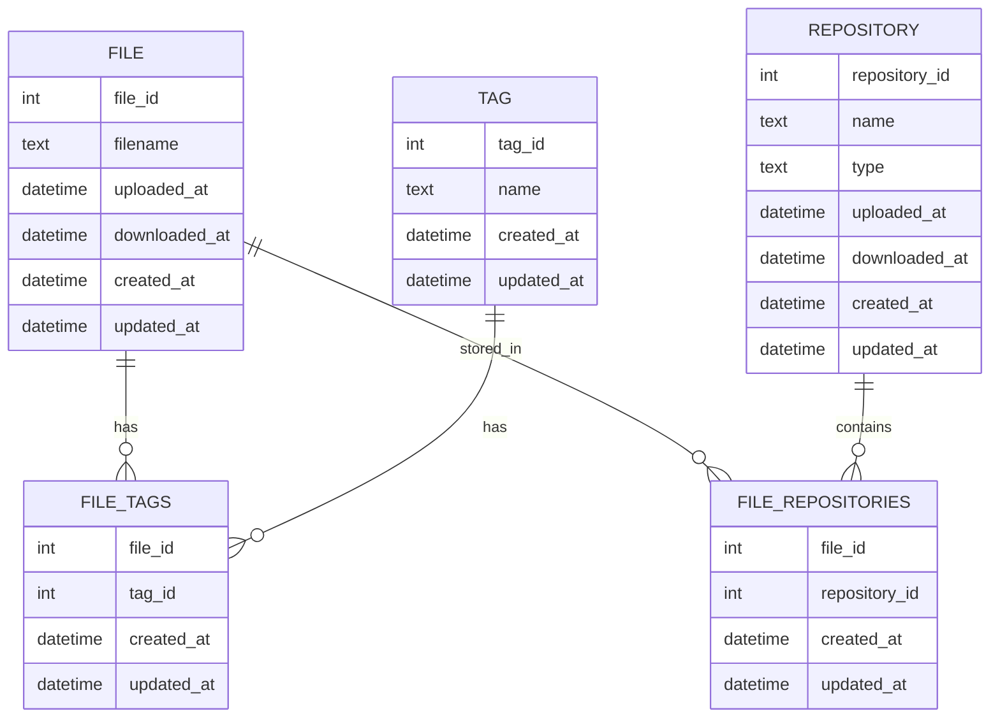

# FreeBooru database

FreeBooru uses a SQLite database to store metadata about the files and tags.
The database file is located at:

```
$HOME/.config/freebooru/collections/<collectionName>/database.db
```

Then it can be easily backed up on any cloud storage using `rclone` or other means.

> TODO: Add back up example here

## Database schema

| Entity            | Description                                                         |
| ----------------- | ------------------------------------------------------------------- |
| FILE              | Metadata for an individual file                                     |
| TAG               | Tag metadata                                                        |
| REPOSITORY        | Storage location info for files (splited from tags for consistency) |
| FILE_TAGS         | Join table linking files to tags                                    |
| FILE_REPOSITORIES | Join table linking files to repositories                            |


